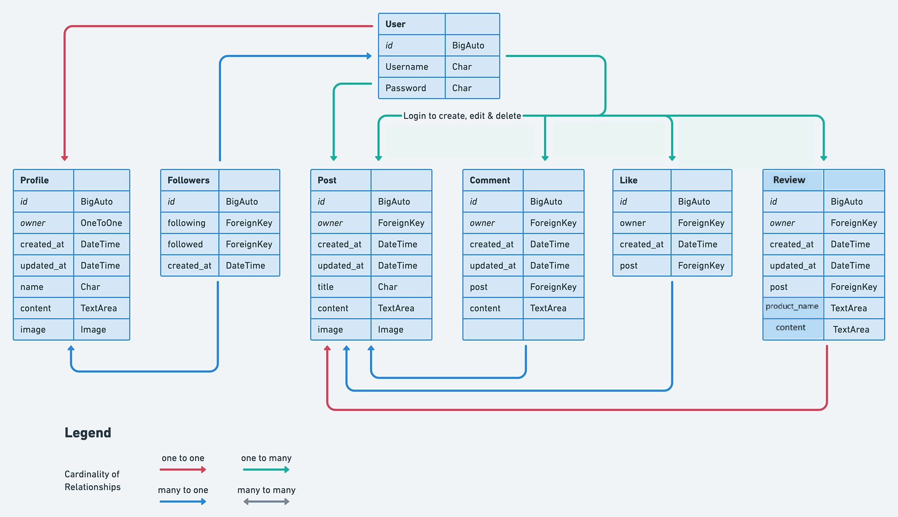
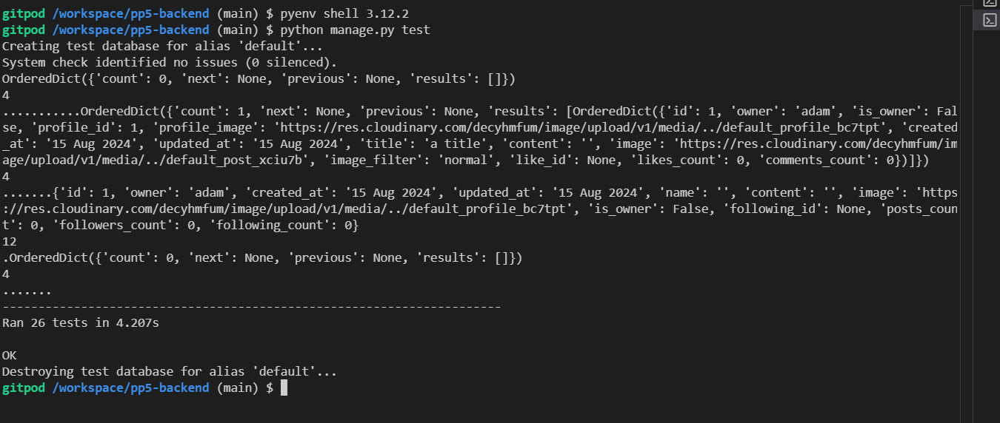

 

<h2>BOOK|tagram API</h2>

<h1 id="contents">Contents</h1>

-   [Introduction](#introduction)
-   [Database Schema](#database-schema)
-   [User Stories](#user-stories)
-   [Agile Methodology](#agile-methodology)
-   [Technologies Used](#technologies-used)
    -   [Languages](#languages)
    -   [Frameworks, libraries, and Programs](#frameworks-libraries-and-programs)
-   [Testing Automated and Manual](TESTING.md)
-   [Bugs](#bugs)
-   [Project Setup](#project-setup)
-   [Deployment](#deployment)
-   [Credits](#credits)
-   [Acknowledgements](#acknowledgements)

## Introduction

This repository is the backend API utilising the Django REST Framework(DRF).

The React frontend project repository can be found [// here //](https://pp5front-c44116638555.herokuapp.com/)

 

## Database Schema
<h2 id="#database-schema"></h2>

<h2 id="user-stories">User Stories</h2>

- As an authenticated user I can login
- As an authenticated user I can edit my profile
- As an authenticated user I can create a comment
- As an authenticated user I can edit a comment
- As an authenticated user I can delete a comment
- As an authenticated user I can create a post
- As an authenticated user I can edit a post
- As an authenticated user I can delete a post
- As an authenticated user I can like other users posts
- As an authenticated user I can follow other users
- As an authenticated user I can add a review of a product
- As an authenticated user I can update a review of a product
- As an authenticated user I can delete a review of a product
- As an authenticated user I can logout

<h2 id="agile-methodology">Agile Methodology</h2>
The Agile Methodology was used to plan this project, implemented through Github and the Project Board.
Project Board can be seen here: https://github.com/users/madeleine2086/projects/3/

## Testing
<h2 id="testing"></h2>
<h3>Manual tests have been performed on this API:</h3>
-   All CRUD functionalites for Post model, Comment model, Review model have been checked in the admin functionality of an API, all are working

<h3>Automated tests:<h3>
-   Created automated tests for comments, reviews, posts, profiles apps.
-   all passed:

## Bugs
-   Cors Header error when signing in access not allowed
-   This was resolved by adding the following to the settings.py:
 
if 'CLIENT_ORIGIN' in os.environ:
 
    CORS_ALLOWED_ORIGINS = [
         
        os.environ.get('CLIENT_ORIGIN')
         
    ]
     
 
if 'CLIENT_ORIGIN_DEV' in os.environ:
 
    extracted_url = re.match(
         
        r'^.+-', os.environ.get('CLIENT_ORIGIN_DEV', ''), re.IGNORECASE
         
    ).group(0)
     
    CORS_ALLOWED_ORIGIN_REGEXES = [
         
        rf"{extracted_url}(eu|us)\d+\w\.codeinstitute-ide\.net$",
         
    ]
     

CORS_ALLOW_CREDENTIALS = True

## Technologies Used

<a href="#top">Back to the top.</a>

### Languages

- Python - Django REST API

### Frameworks, libraries, and Programs

- Django Cloudinary Storage

- Django Filter

- PyJWT

- psycopg

- Pillow

- Git

- Github

- Gitpod

- Heroku

- Django Rest Auth

- PostgreSQL

- gunicorn

- Cors headers

## Project Setup

Use the Code Institutes full template to create a new repository, and open it in Gitpod.

Install Django by using the terminal command:

- pip3 install 'django<4'
- start the project using the terminal command:
django-admin startproject drf_api . 
- The dot at the end initializes the project in the current directory.
- Install the Cloudinary library using the terminal command:
- pip install django-cloudinary-storage
- Install the Pillow library for image processing capabilities using the terminal command:
pip install Pillow

Go to settings.py file to add the newly installed apps, the order is important:

INSTALLED_APPS = [
     
    'django.contrib.admin',
     
    'django.contrib.auth',
     
    'django.contrib.contenttypes',
     
    'django.contrib.sessions',
     
    'django.contrib.messages',
     
    'cloudinary_storage', 
     
    'django.contrib.staticfiles',
     
    'cloudinary',
     
]
 
 
Create an env.py file in the top directory
 
In the env.py file and add the following for the cloudinary url:
 
 
import os
 
os.environ["CLOUDINARY_URL"] = "cloudinary://API KEY HERE"
 
 
In the settings.py file set up cloudinary credentials, define the media url and default file storage with the following code:
 
 
import os
 

if os.path.exists('env.py'):
 
    import env
     
     

CLOUDINARY_STORAGE = {
     
    'CLOUDINARY_URL': os.environ.get('CLOUDINARY_URL')
     
}
 
MEDIA_URL = '/media/'
 
DEFAULT_FILE_STORAGE = 'cloudinary_storage.storage.MediaCloudinaryStorage'
 
 
Workspace is now ready to use.

## Deployment

<a href="#top">Back to the top.</a>

- Install JSON Web Token authentication by using the terminal command:
 
pip install dj-rest-auth
 
- In settings.py add these 2 items to the installed apps list:
 
'rest_framework.authtoken'
 
'dj_rest_auth'
 
 
- In the main urls.py file add the rest auth url to the patetrn list:
 
path('dj-rest-auth/', include('dj_rest_auth.urls')),
 
 
- Migrate the database using the terminal command:
 
python manage.py migrate
 
 
- To allow users to register install Django Allauth:
 
pip install 'dj-rest-auth[with_social]'
 
 

- In settings.py add the following to the installed app list:
 
'django.contrib.sites',
 
'allauth',
 
'allauth.account',
 
'allauth.socialaccount',
 
'dj_rest_auth.registration',
 
 
- also add the line in settings.py
 
SITE_ID = 1
 
 
- In the main urls.py file add the registration url to patterns:
 
 path(
     
        'dj-rest-auth/registration/', include('dj_rest_auth.registration.urls')
         
    ),
     
     
- Install the JSON tokens with the simple jwt library:
 
pip install djangorestframework-simplejwt
 
 
- In env.py set DEV to 1 to check wether in development or production
 
os.environ['DEV'] = '1'
 
 
- In settings.py add an if/else statement to check development or production:
 
REST_FRAMEWORK = {
     
    'DEFAULT_AUTHENTICATION_CLASSES': [(
         
        'rest_framework.authentication.SessionAuthentication'
         
        if 'DEV' in os.environ
         
        else 'dj_rest_auth.jwt_auth.JWTCookieAuthentication'
         
    )],
     
     
- Add the following code in settings.py
 
REST_USE_JWT = True # enables token authentication
 
JWT_AUTH_SECURE = True # tokens sent over HTTPS only
 
JWT_AUTH_COOKIE = 'my-app-auth' #access token
 
JWT_AUTH_REFRESH_COOKIE = 'my-refresh-token' #refresh token
 
 
- Create a serializers.py file in the foodsnap_api file(project file name)
- Copy the code from the Django documentation UserDetailsSerializer as follows:
 
from dj_rest_auth.serializers import UserDetailsSerializer
 
from rest_framework import serializers
 

class CurrentUserSerializer(UserDetailsSerializer):
    """Serializer for Current User"""
    profile_id = serializers.ReadOnlyField(source='profile.id')
    profile_image = serializers.ReadOnlyField(source='profile.image.url')

    class Meta(UserDetailsSerializer.Meta):
        """Meta class to to specify fields"""
        fields = UserDetailsSerializer.Meta.fields + (
            'profile_id', 'profile_image'
        )
- In settings.py overwrite the default User Detail serializer:
 
REST_AUTH_SERIALIZERS = {
     
    'USER_DETAILS_SERIALIZER': 'drf_api.serializers.CurrentUserSerializer'
     
}
 
 
- Run the migrations for database again

- Update the requirements file with the following terminal command
 
pip freeze > requirements.txt
 
- Make sure to save all files, add and commit followed by pushing to Github.

## Credits
- This project was made possible due to help of tutoring team and analysing lots of public repositories:
    - Code Institute "Moments" walkthrough helped me setup the base for BOOK|tagram
    - https://github.com/JaqiKal
    - https://github.com/artcuddy 
    - I'd like to thank everyone in Code institute, my family for still speaking to me, and my friend Colm for being a very good website user.

## Acknowledgements

<a href="#top">Back to the top.</a>
